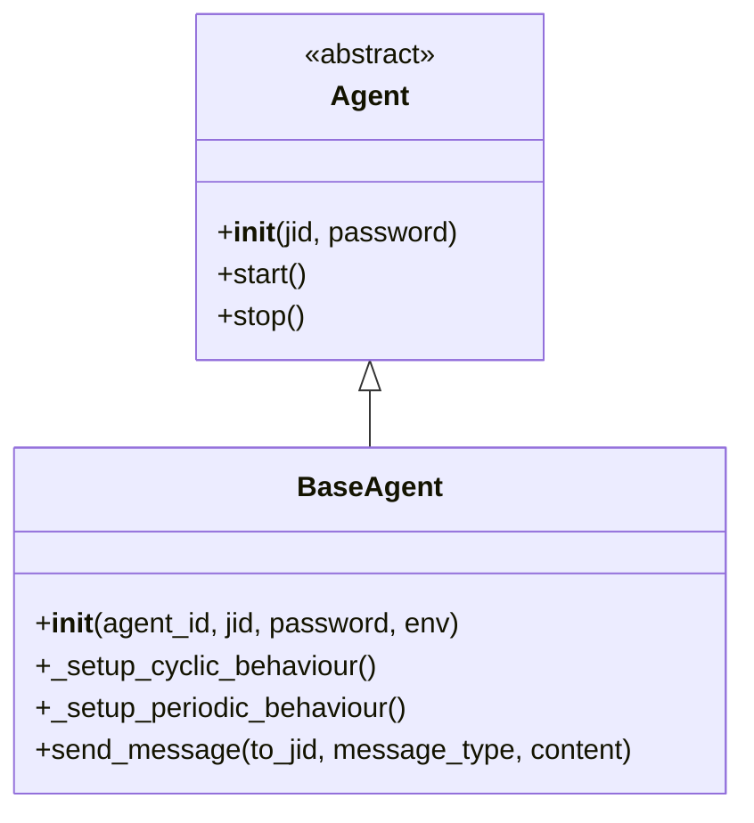

# Base Agent Documentation

## Overview
The `BaseAgent` class provides the foundation for all agents in the Assembly Line System. It implements core functionality for agent communication, behavior management, and integration with the environment.

## Class Hierarchy



## Class Definition

### AssemblyLineAgent
```python
from assembly_line_system.agents.base_agent import AssemblyLineAgent

class MyAgent(AssemblyLineAgent):
    def __init__(self, agent_id, jid, password, env):
        super().__init__(agent_id, jid, password, env)
```

## Initialization

### __init__(agent_id, jid, password, env)
```python
def __init__(self, agent_id, jid, password, env):
```

**Parameters:**
- `agent_id` (str): Unique identifier for the agent
- `jid` (str): JID for XMPP communication
- `password` (str): Password for XMPP authentication
- `env`: Reference to the shared environment

**Description:**
Initializes the agent with communication credentials and environment reference.

## Behavior Setup

### _setup_cyclic_behaviour()
```python
def _setup_cyclic_behaviour(self):
```

**Returns:**
- `CyclicBehaviour`: Configured cyclic behavior

**Description:**
Sets up a cyclic behavior for continuous agent operation.

### _setup_periodic_behaviour()
```python
def _setup_periodic_behaviour(self):
```

**Returns:**
- `PeriodicBehaviour`: Configured periodic behavior

**Description:**
Sets up a periodic behavior for regular agent tasks.

## Communication

### send_message(to_jid, message_type, content)
```python
async def send_message(self, to_jid, message_type, content):
```

**Parameters:**
- `to_jid` (str): Recipient JID
- `message_type` (str): Type of message (e.g., 'material_transfer', 'task_assignment')
- `content` (dict): Message content

**Description:**
Sends a message using SPADE protocols.

## Lifecycle Methods

### setup()
```python
async def setup(self):
```

**Description:**
Sets up the agent for operation.

### start_agent()
```python
async def start_agent(self):
```

**Description:**
Starts the agent.

### stop_agent()
```python
async def stop_agent(self):
```

**Description:**
Stops the agent.

## Example Usage

```python
# Create a mock environment
class MockEnv:
    pass

env = MockEnv()

# Create an agent
agent = AssemblyLineAgent("test_agent", "test_agent@localhost", "password", env)

# Start the agent
await agent.start_agent()

# Send a test message
await agent.send_message("recipient@localhost", "test_message", {"data": "Hello World!"})

# Stop the agent
await agent.stop_agent()
```

## Inheritance

### Extending BaseAgent

To create a specific type of agent, extend the `AssemblyLineAgent` class and override the behavior setup methods:

```python
from assembly_line_system.agents.base_agent import AssemblyLineAgent

class ConveyorAgent(AssemblyLineAgent):
    def __init__(self, agent_id, jid, password, env):
        super().__init__(agent_id, jid, password, env)
        self.speed = 1.0
        self.capacity = 5

    def _setup_cyclic_behaviour(self):
        class ConveyorCyclicBehaviour(CyclicBehaviour):
            async def run(self):
                print(f"{self.agent_id}: Transporting materials")
                # Implementation specific to conveyor agents

        return ConveyorCyclicBehaviour()

    def _setup_periodic_behaviour(self):
        class ConveyorPeriodicBehaviour(PeriodicBehaviour):
            async def run(self):
                print(f"{self.agent_id}: Optimizing route")
                # Implementation specific to conveyor agents

        return ConveyorPeriodicBehaviour(period=10)
```

This documentation provides a comprehensive overview of the `BaseAgent` class, enabling developers to understand its functionality and extend it for specific agent types in the Assembly Line System.