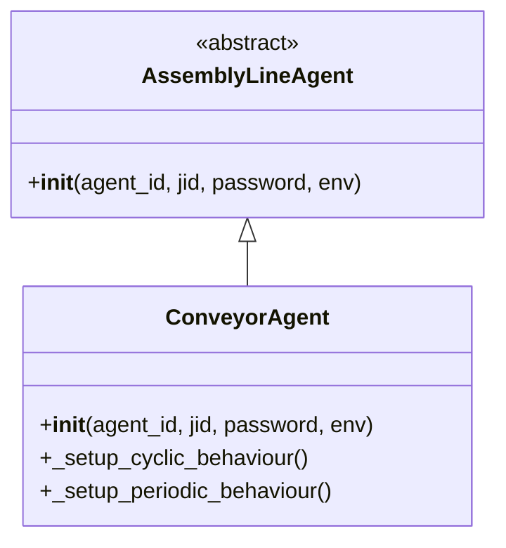

# Conveyor Agent Documentation

## Overview
The `ConveyorAgent` class represents conveyor belt agents in the Assembly Line System. These agents are responsible for transporting materials between different stations in the assembly line.

## Class Hierarchy



## Class Definition

### ConveyorAgent
```python
from assembly_line_system.agents.conveyor_agent import ConveyorAgent

agent = ConveyorAgent("conveyor_1", "conveyor_1@localhost", "password", env)
```

## Initialization

### __init__(agent_id, jid, password, env)
```python
def __init__(self, agent_id, jid, password, env):
```

**Parameters:**
- `agent_id` (str): Unique identifier for the agent
- `jid` (str): JID for XMPP communication
- `password` (str): Password for XMPP authentication
- `env`: Reference to the shared environment

**Description:**
Initializes the conveyor agent with communication credentials, environment reference, and conveyor-specific attributes.

## Conveyor Attributes

### speed
```python
self.speed = 1.0  # Transport speed (units per time step)
```

**Type:** float

**Description:**
The transport speed of the conveyor belt.

### capacity
```python
self.capacity = 5  # Maximum materials that can be transported simultaneously
```

**Type:** int

**Description:**
The maximum number of materials the conveyor can transport at once.

### current_load
```python
self.current_load = 0  # Current number of materials being transported
```

**Type:** int

**Description:**
The current number of materials being transported by the conveyor.

## Behavior Setup

### _setup_cyclic_behaviour()
```python
def _setup_cyclic_behaviour(self):
```

**Returns:**
- `ConveyorCyclicBehaviour`: Configured cyclic behavior

**Description:**
Sets up a cyclic behavior for continuous material transport operations.

### _setup_periodic_behaviour()
```python
def _setup_periodic_behaviour(self):
```

**Returns:**
- `ConveyorPeriodicBehaviour`: Configured periodic behavior

**Description:**
Sets up a periodic behavior for route optimization and other regular tasks.

## Internal Methods

### _request_materials()
```python
async def _request_materials(self):
```

**Description:**
Requests materials from the previous station in the assembly line.

### _transport_materials()
```python
async def _transport_materials(self):
```

**Description:**
Transports materials to the next station in the assembly line.

### _optimize_route()
```python
async def _optimize_route(self):
```

**Description:**
Optimizes the transport route based on current conditions and learned policies.

## Lifecycle Methods

### setup()
```python
async def setup(self):
```

**Description:**
Sets up the conveyor agent for operation.

### on_start()
```python
async def on_start(self):
```

**Description:**
Handles the agent start event.

### on_stop()
```python
async def on_stop(self):
```

**Description:**
Handles the agent stop event.

## Example Usage

```python
# Create a mock environment
class MockEnv:
    pass

env = MockEnv()

# Create a conveyor agent
agent = ConveyorAgent("conveyor_1", "conveyor_1@localhost", "password", env)

# Start the agent
await agent.start_agent()

# The agent will now:
# - Continuously transport materials (cyclic behavior)
# - Periodically optimize its route (periodic behavior)

# Stop the agent
await agent.stop_agent()
```

## Integration with Environment

The conveyor agent interacts with the environment through its behaviors:

1. **Cyclic Behavior**: Continuously checks for new materials to transport and moves existing materials forward
2. **Periodic Behavior**: Periodically optimizes the transport route based on current conditions and learned policies

## Communication Protocols

The conveyor agent uses the material transfer protocol to coordinate with other agents:

1. **Request Materials**: Sends requests to previous stations for new materials
2. **Confirm Transfers**: Receives confirmations from next stations before transferring materials
3. **Execute Transfers**: Initiates material transfers when conditions are met
4. **Confirm Completion**: Receives completion confirmations from receiving agents

## Learning Integration

The conveyor agent integrates with RLlib for reinforcement learning:

1. **Policy Network**: Uses a policy network to determine optimal actions
2. **Experience Replay**: Stores successful transport strategies in an experience replay buffer
3. **Reward Signals**: Receives rewards based on transport efficiency and timeliness

## Testing the Conveyor Agent

### Basic Tests
```python
def test_conveyor_agent_initialization():
    env = MockEnv()
    agent = ConveyorAgent("conveyor_1", "jid", "password", env)
    assert agent.agent_id == "conveyor_1"
    assert agent.speed == 1.0
    assert agent.capacity == 5

def test_conveyor_agent_behaviors():
    env = MockEnv()
    agent = ConveyorAgent("conveyor_1", "jid", "password", env)
    assert len(agent.default_behaviours) == 2
    assert agent.default_behaviours[0].__class__.__name__ == "ConveyorCyclicBehaviour"
    assert agent.default_behaviours[1].__class__.__name__ == "ConveyorPeriodicBehaviour"
```

### Integration Tests
```python
def test_conveyor_agent_transport():
    env = MockEnv()
    agent = ConveyorAgent("conveyor_1", "jid", "password", env)

    # Test initial state
    assert agent.current_load == 0

    # Simulate receiving materials
    agent.current_load = 3
    assert agent.current_load == 3

    # Test transport functionality
    assert hasattr(agent, '_transport_materials')
```

This documentation provides a comprehensive overview of the `ConveyorAgent` class, enabling developers to understand its functionality and integrate it into the Assembly Line System.