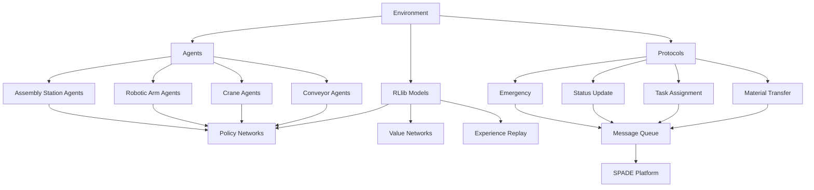

# System Architecture Overview

## Introduction

The Assembly Line System is designed as a modular, extensible framework for simulating industrial assembly lines. The system architecture consists of several key components that work together to create a cohesive simulation environment.

## Core Components

### 1. Environment
The environment serves as the central simulation space where all agents operate. It follows the Gymnasium standard for reinforcement learning environments.

- **Responsibilities**:
  - Maintain state of all stations and materials
  - Process agent actions
  - Calculate rewards and terminal conditions
  - Provide observations to agents

### 2. Agents
Agents represent the physical components of the assembly line and are implemented using SPADE.

- **Types**:
  - Conveyor Belt Agents
  - Crane Agents
  - Robotic Arm Agents
  - Assembly Station Agents

- **Responsibilities**:
  - Perform specific tasks (transport, lifting, assembly)
  - Communicate with other agents
  - Learn optimal behaviors through reinforcement learning

### 3. Communication Protocols
Standardized protocols enable reliable communication between agents.

- **Types**:
  - Material Transfer Protocol
  - Task Assignment Protocol
  - Status Update Protocol
  - Emergency Protocol

### 4. Reinforcement Learning Models
RLlib models enable agents to learn optimal behaviors.

- **Components**:
  - Policy Networks: Determine agent actions
  - Value Networks: Evaluate state values
  - Experience Replay Buffers: Store learning experiences

## Architecture Diagram

## Interaction Flow

1. **Environment Initialization**: The environment creates all stations and initial materials
2. **Agent Setup**: Each agent initializes its communication channels and RLlib models
3. **Simulation Loop**:
   - Agents receive observations from the environment
   - Agents select actions using their policy networks
   - Actions are executed in the environment
   - Environment updates state and calculates rewards
4. **Learning**: Agents update their models based on received rewards

## Key Design Principles

- **Modularity**: Components are designed to be easily extended or replaced
- **Standardization**: Use of established frameworks (Gymnasium, SPADE, RLlib)
- **Scalability**: Architecture supports addition of more agents and stations
- **Realism**: Simulation aims to mimic real-world assembly line operations

## Implementation Details

### Environment
- Implements Gymnasium's `Env` interface
- Uses discrete time steps to simulate real-time operations
- Provides observations as normalized feature vectors

### Agents
- Extend SPADE's `Agent` base class
- Implement cyclic and periodic behaviors for continuous operation
- Integrate with RLlib policy networks for decision making

### Protocols
- Use XMPP messages for agent communication
- Define standardized message formats and subjects
- Implement request-response patterns for reliable communication

### RLlib Models
- Use TensorFlow/Keras for neural network implementation
- Implement shared base models with agent-specific layers
- Configure centralized training with decentralized execution

This architecture provides a solid foundation for simulating and optimizing assembly line operations using reinforcement learning.