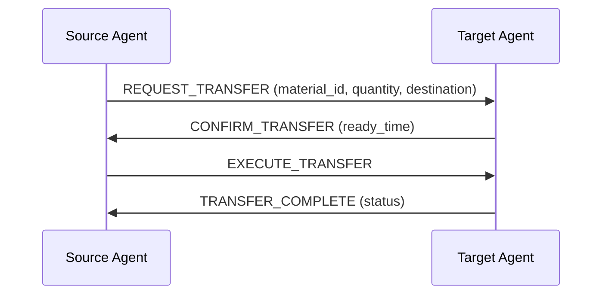

# Material Transfer Protocol Documentation

## Overview
The Material Transfer Protocol enables reliable communication between agents for transferring materials in the assembly line system. This protocol defines standardized message formats and behavior patterns for material transfers.

## Protocol Diagram



## Message Types

### 1. REQUEST_TRANSFER
**Purpose**: Request transfer of materials from source to target agent.

**Message Format**:
```json
{
    "source": "agent_id",
    "material_id": "mat123",
    "quantity": 5,
    "destination": "assembly_station_1"
}
```

**Subject**: `material_transfer_request`

### 2. CONFIRM_TRANSFER
**Purpose**: Confirm readiness to receive materials.

**Message Format**:
```json
{
    "target": "agent_id",
    "ready_time": 10
}
```

**Subject**: `material_transfer_confirm`

### 3. EXECUTE_TRANSFER
**Purpose**: Initiate the material transfer.

**Message Format**:
```json
{
    "source": "agent_id"
}
```

**Subject**: `material_transfer_execute`

### 4. TRANSFER_COMPLETE
**Purpose**: Confirm completion of material transfer.

**Message Format**:
```json
{
    "target": "agent_id",
    "status": "success"
}
```

**Subject**: `material_transfer_complete`

## Implementation

### Message Creation

#### create_request_message()
```python
msg = MaterialTransferProtocol.create_request_message(
    source_id,
    target_jid,
    material_id,
    quantity,
    destination
)
```

#### create_confirm_message()
```python
msg = MaterialTransferProtocol.create_confirm_message(
    target_id,
    source_jid,
    ready_time
)
```

#### create_execute_message()
```python
msg = MaterialTransferProtocol.create_execute_message(
    source_id,
    target_jid
)
```

#### create_complete_message()
```python
msg = MaterialTransferProtocol.create_complete_message(
    target_id,
    source_jid,
    status
)
```

## Message Handling

### handle_request(agent, msg)
```python
response = MaterialTransferProtocol.handle_request(agent, msg)
```

**Parameters:**
- `agent`: The receiving agent
- `msg`: Incoming XMPP message

**Returns:**
- Message: Confirmation message or None if request is refused

**Description:**
Handles a material transfer request and returns a confirmation message if the agent can accept the transfer.

### handle_execute(agent, msg)
```python
response = MaterialTransferProtocol.handle_execute(agent, msg)
```

**Parameters:**
- `agent`: The receiving agent
- `msg`: Incoming XMPP message

**Returns:**
- Message: Completion message

**Description:**
Handles a material transfer execution and returns a completion message.

## Example Usage

### Sending a Transfer Request
```python
from assembly_line_system.protocols.material_transfer import MaterialTransferProtocol

# Create a request message
msg = MaterialTransferProtocol.create_request_message(
    "conveyor_1",
    "crane_1@localhost",
    "material_42",
    3,
    "assembly_station_1"
)

# Send the message
await agent.send(msg)
```

### Handling a Transfer Request
```python
async def handle_incoming_message(agent, msg):
    if msg.subject == MaterialTransferProtocol.REQUEST_TRANSFER:
        response = MaterialTransferProtocol.handle_request(agent, msg)
        if response:
            await agent.send(response)
```

### Completing a Transfer
```python
async def handle_execute_message(agent, msg):
    if msg.subject == MaterialTransferProtocol.EXECUTE_TRANSFER:
        # Perform the transfer
        status = agent.perform_transfer()

        # Send completion message
        response = MaterialTransferProtocol.create_complete_message(
            agent.agent_id, msg.sender, status
        )
        await agent.send(response)
```

## Error Handling

### Common Errors
1. **Refusal**: Agent cannot accept transfer (capacity limits, incompatible materials)
2. **Timeout**: No response within expected timeframe
3. **Failure**: Transfer execution fails

### Error Response Format
```json
{
    "error": true,
    "code": "002",  # Refusal
    "message": "Cannot accept transfer due to capacity limits"
}
```

### Error Codes
- `001`: Timeout - No response received within expected timeframe
- `002`: Refusal - Agent refuses to perform requested action
- `003`: Execution Failure - Transfer execution fails
- `004`: Invalid Request Format - Message format is incorrect

## Integration with Agents

### Conveyor Agent
- Uses protocol to request materials from previous stations
- Sends execution messages when ready to transfer

### Crane Agent
- Receives transfer requests and confirms readiness
- Handles execution messages to perform lifting operations

### Robotic Arm Agent
- Uses protocol for component transfers between stations
- Coordinates with assembly stations for precise placements

### Assembly Station Agent
- Receives final component transfers
- Confirms completion of assembly operations

## Testing the Protocol

### Basic Tests
```python
def test_material_transfer_request():
    msg = MaterialTransferProtocol.create_request_message(
        "conveyor_1",
        "crane_1@localhost",
        "material_42",
        3,
        "assembly_station_1"
    )
    assert msg.to == "crane_1@localhost"
    assert msg.subject == MaterialTransferProtocol.REQUEST_TRANSFER

def test_material_transfer_confirm():
    msg = MaterialTransferProtocol.create_confirm_message(
        "crane_1",
        "conveyor_1@localhost",
        5
    )
    assert msg.to == "conveyor_1@localhost"
    assert msg.subject == MaterialTransferProtocol.CONFIRM_TRANSFER
```

### Integration Tests
```python
def test_material_transfer_handling():
    class MockAgent:
        def __init__(self):
            self.agent_id = "mock_agent"
            self.transfers = []

        def can_accept_transfer(self, material_id, quantity):
            return True

        def get_ready_time(self):
            return 5

        def perform_transfer(self):
            self.transfers.append("transfer_performed")
            return "success"

    agent = MockAgent()

    # Test request handling
    msg = MaterialTransferProtocol.create_request_message(
        "source_agent",
        "mock_agent@localhost",
        "material_42",
        3,
        "destination"
    )
    response = MaterialTransferProtocol.handle_request(agent, msg)
    assert response is not None
    assert response.subject == MaterialTransferProtocol.CONFIRM_TRANSFER

    # Test execution handling
    msg = MaterialTransferProtocol.create_execute_message(
        "source_agent",
        "mock_agent@localhost"
    )
    response = MaterialTransferProtocol.handle_execute(agent, msg)
    assert response is not None
    assert response.subject == MaterialTransferProtocol.TRANSFER_COMPLETE
    assert len(agent.transfers) == 1
```

This documentation provides a comprehensive overview of the Material Transfer Protocol, enabling developers to implement and integrate reliable material transfer functionality in the Assembly Line System.