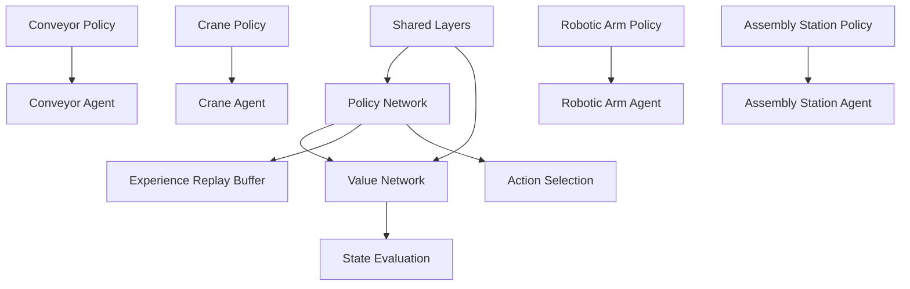

# RLlib Models Overview

## Introduction
The Assembly Line System uses RLlib to implement reinforcement learning models for agent decision making. This document provides an overview of the RLlib integration and model architecture.

## Architecture

### Model Components


## Model Types

### 1. Shared Base Model
All agent-specific models extend from a shared base model that provides common functionality.

```python
class AssemblyLineModel(TFModelV2):
    def __init__(self, obs_space, action_space, num_outputs, model_config, name):
        super(AssemblyLineModel, self).__init__(obs_space, action_space, num_outputs, model_config, name)

        # Define shared layers
        self.shared_layers = tf.keras.Sequential([
            tf.keras.layers.Dense(128, activation='relu'),
            tf.keras.layers.Dense(64, activation='relu')
        ])
```

### 2. Agent-Specific Models
Each agent type has its own specialized model that extends the base model.

#### Conveyor Model
```python
class ConveyorModel(TFModelV2):
    def __init__(self, obs_space, action_space, num_outputs, model_config, name):
        super(ConveyorModel, self).__init__(obs_space, action_space, num_outputs, model_config, name)

        # Conveyor-specific layers
        self.conveyor_layers = tf.keras.Sequential([
            tf.keras.layers.Dense(64, activation='relu'),
            tf.keras.layers.Dense(num_outputs, activation='softmax')
        ])
```

## Training Strategy

### Centralized Training
- All agents are trained simultaneously using shared experiences
- Centralized training allows agents to learn from each other's experiences

### Decentralized Execution
- Trained policies are deployed in decentralized execution mode
- Each agent makes independent decisions based on its local observations

## Learning Approach

### On-Policy Learning
- Agents learn while actively participating in the assembly line operations
- Experiences are collected during real-time simulation

### Curriculum Learning
1. **Phase 1**: Basic operations (material transport, simple assembly tasks)
2. **Phase 2**: Coordination (multi-agent material handling, task allocation)
3. **Phase 3**: Advanced optimization (complex assembly sequences, energy efficiency)
4. **Phase 4**: Robustness training (failure scenarios, maintenance situations)

## Experience Replay

### Shared Buffer
- All agents contribute to a shared experience replay buffer
- Successful strategies are shared across similar agent types

### Experience Sharing
```python
def share_experience(agent_id, experience):
    if experience[SampleBatch.REWARD] > THRESHOLD_SUCCESS:
        for other_agent in get_same_type_agents(agent_id):
            shared_buffer.add_experience(experience)
```

## Model Integration

### Policy Network
- Determines optimal actions based on current state
- Uses shared layers for common features + agent-specific layers

### Value Network
- Evaluates state values for reinforcement learning algorithms
- Shared across all agent types

### Action Selection
- Agents use their policy networks to select actions
- Actions are executed in the environment and result in state changes

## Training Process

### 1. Environment Setup
- Initialize the assembly line environment with stations and materials

### 2. Agent Initialization
- Create agents with their RLlib policy networks
- Connect agents to the environment

### 3. Training Loop
1. **Reset Environment**: Start with initial state
2. **Collect Experiences**:
   - Agents select actions using their policies
   - Actions are executed in the environment
   - Rewards and new states are observed
3. **Store Experiences**: Add experiences to replay buffer
4. **Train Models**:
   - Sample mini-batches from replay buffer
   - Update policy and value networks
5. **Evaluate Performance**: Track learning progress

### 4. Curriculum Progression
- Gradually increase task complexity as agents learn
- Move to more advanced phases when performance thresholds are met

## Implementation Details

### Model Registration
```python
from ray.rllib.models import ModelCatalog

ModelCatalog.register_custom_model("conveyor_model", ConveyorModel)
```

### Training Configuration
```python
config = {
    "env": AssemblyLineEnv,
    "model": {
        "custom_model": "conveyor_model",
        "custom_model_config": {}
    },
    "num_workers": 2,
    "train_batch_size": 1000,
    "gamma": 0.99,
    "lambda": 0.95,
    "entropy_coeff": 0.01
}
```

### Training Execution
```python
trainer = DQNTrainer(config=config, env=env)

for i in range(100):  # Training iterations
    result = trainer.train()
    print(f"Iteration {i}: Reward: {result['episode_reward_mean']}")

checkpoint = trainer.save()
print(f"Checkpoint saved at: {checkpoint}")
```

## Validation and Testing

### Learning Metrics
- **Policy Loss**: Track improvement in policy network
- **Action Distribution**: Monitor changes in agent behavior
- **Reward Signals**: Measure progress through reward signals

### Validation Methods
1. **Learning Curves**: Plot reward and loss over training episodes
2. **Behavior Analysis**: Compare action distributions before/after training
3. **Policy Comparison**: Evaluate against random or heuristic baselines

## Benefits of RLlib Integration

### 1. Scalability
- Efficient training across multiple agents
- Distributed training with Ray

### 2. Flexibility
- Support for various RL algorithms (DQN, PPO, etc.)
- Customizable model architectures

### 3. Performance
- Optimized TensorFlow/PyTorch implementations
- Efficient experience replay and batching

### 4. Integration
- Seamless compatibility with Gymnasium environments
- Easy deployment of trained policies

This overview provides a comprehensive understanding of the RLlib integration in the Assembly Line System, enabling developers to implement and train reinforcement learning models for agent decision making.