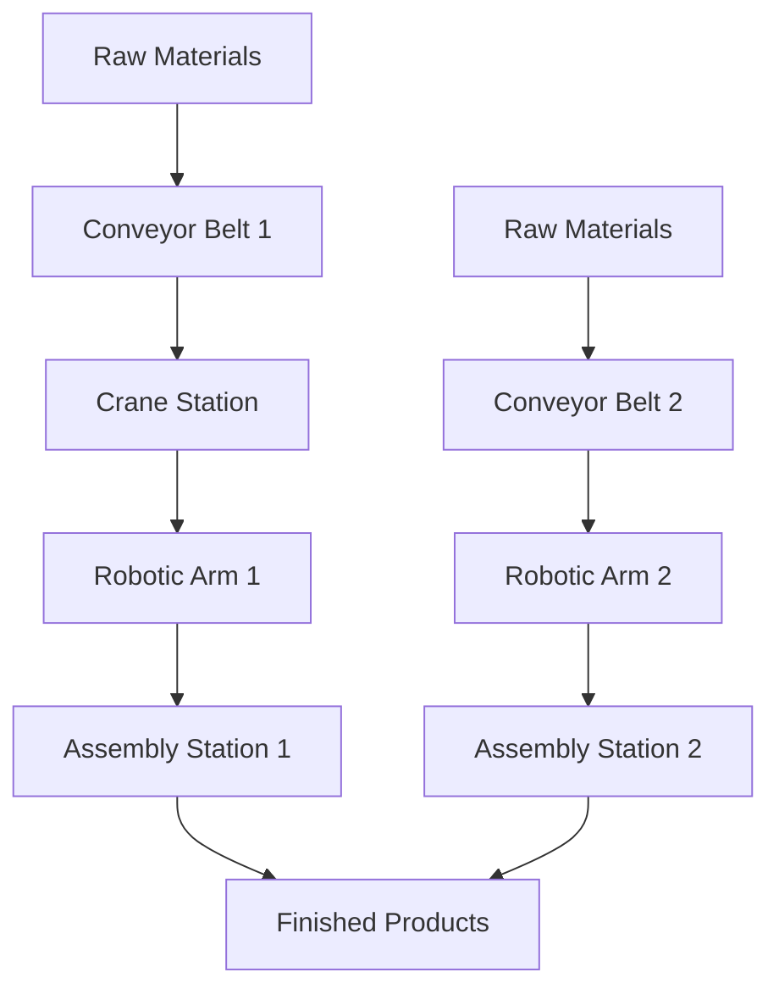

# Assembly Line System Overview

## Executive Summary
This document provides a comprehensive overview of the multi-agent assembly line system designed to optimize product assembly using SPADE for agent communication and RLlib for reinforcement learning. The system simulates an industrial assembly line with conveyor belts, cranes, robotic arms, and assembly stations working together to produce finished products from raw materials.

## System Architecture

### Core Components
1. **SPADE Agent Platform**: Manages agent communication and coordination
2. **RLlib Learning Framework**: Implements reinforcement learning algorithms
3. **Simulation Environment**: Replicates the assembly line for testing and validation

### Agent Types
- **Conveyor Belt Agents**: Transport materials between stations
- **Crane Agents**: Move heavy objects between areas
- **Robotic Arm Agents**: Perform precise assembly tasks
- **Assembly Station Agents**: Assemble final products

## Learning Objectives

### Conveyor Belt Agents
- Optimize transport routes and speeds
- Balance load across multiple belts
- Predictive maintenance

### Crane Agents
- Optimize lifting operations
- Collision avoidance
- Load management

### Robotic Arm Agents
- Improve assembly precision and speed
- Task prioritization
- Error recovery

### Assembly Station Agents
- Optimize assembly sequences
- Resource allocation
- Quality control

## Interaction Protocols

### Key Protocols
1. **Material Transfer Protocol**: Coordinates material movement
2. **Task Assignment Protocol**: Dynamically allocates tasks
3. **Status Update Protocol**: Maintains situational awareness
4. **Emergency Protocol**: Handles unexpected events

### Communication Patterns
- Publisher-Subscriber for broadcasts
- Request-Response for specific actions
- Contract Net Protocol for dynamic task allocation

## Simulation Environment

### Physical Layout

### Key Features
- Follows the Gymnasium standard for reinforcement learning environments
- Discrete time steps representing assembly operations
- State representation including material locations and agent positions
- Reward signals based on task completion, resource usage, and product quality

## Reinforcement Learning Implementation

### Policy Network Design
- Shared base model with common layers
- Agent-specific policy networks for specialized tasks
- Centralized training with decentralized execution

### Training Strategy
- On-policy learning with experience replay
- Curriculum learning approach with progressive complexity
- Shared experience pool for accelerated learning

### Multi-Agent Coordination
- Centralized training configuration
- Individual rewards with team bonuses
- Conflict resolution mechanisms

## Test and Validation Plan

### Testing Strategy
1. **Unit Testing**: Individual components validation
2. **Integration Testing**: Component interaction verification
3. **System Testing**: Complete system validation
4. **Performance Testing**: Scalability and efficiency measurement

### Validation Approach
- Learning progress tracking through policy metrics
- Coordination quality analysis
- Robustness testing under adverse conditions

### Key Metrics
- Throughput rate
- System efficiency
- Quality control performance
- Agent coordination quality

## Implementation Roadmap

### Phase 1: Environment Setup
- Implement basic environment structure
- Define material flow logic
- Set up reward calculation

### Phase 2: Agent Development
- Create SPADE agent implementations
- Integrate RLlib policy networks
- Implement communication protocols

### Phase 3: Training and Optimization
- Set up centralized training infrastructure
- Implement curriculum learning phases
- Fine-tune reward functions

### Phase 4: Testing and Deployment
- Execute comprehensive test suite
- Validate learning progress
- Deploy to production environment

## Benefits and Expected Outcomes

### Operational Efficiency
- Optimized material flow and resource allocation
- Reduced production time and costs
- Improved product quality through precise assembly

### Adaptability
- Agents learn to adapt to changing conditions
- Dynamic task allocation based on current demands
- Predictive maintenance to minimize downtime

### Scalability
- System can scale with additional agents/stations
- Modular architecture allows easy integration of new components
- Performance optimized for real-time operation

### Data-Driven Decision Making
- Comprehensive monitoring and analytics
- Learning progress visualization
- Performance benchmarking

This assembly line system represents a state-of-the-art solution for automated manufacturing, combining the power of multi-agent systems with advanced reinforcement learning techniques to achieve optimal production efficiency.