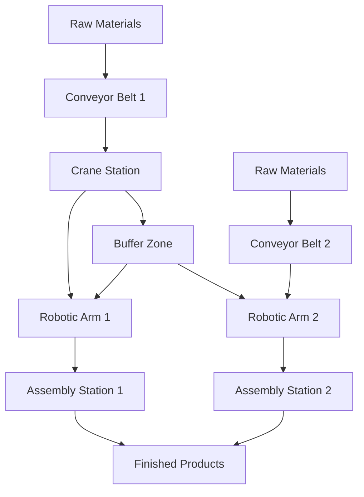

# Simulation Environment Design

## Overview
The simulation environment will replicate the assembly line system, allowing agents to learn and interact in a controlled setting. The environment will follow the Gymnasium standard for reinforcement learning environments, ensuring compatibility with RLlib and other reinforcement learning frameworks.

## Environment Structure

### 1. Physical Layout


### 2. Environment Components

#### a) Material Class
```python
class Material:
    def __init__(self, material_id, type, weight, destination):
        self.material_id = material_id
        self.type = type  # e.g., "metal", "plastic", "electronic"
        self.weight = weight
        self.destination = destination  # target assembly station
        self.location = "raw_materials"  # current location
        self.status = "available"
```

#### b) Station Class
```python
class Station:
    def __init__(self, station_id, station_type):
        self.station_id = station_id
        self.station_type = station_type  # "conveyor", "crane", "robotic_arm", "assembly"
        self.materials = []  # queue of materials at this station
        self.status = "idle"
        self.occupancy = 0
```

#### c) AssemblyLineEnvironment Class
```python
class AssemblyLineEnvironment:
    def __init__(self):
        self.stations = self._initialize_stations()
        self.materials = []
        self.time_step = 0
        self.agents = {}  # dictionary of active agents

    def _initialize_stations(self):
        stations = {
            "conveyor_1": Station("conveyor_1", "conveyor"),
            "crane_1": Station("crane_1", "crane"),
            "robotic_arm_1": Station("robotic_arm_1", "robotic_arm"),
            "assembly_1": Station("assembly_1", "assembly"),
            # ... other stations
        }
        return stations

    def reset(self):
        """Reset the environment to initial state"""
        self.stations = self._initialize_stations()
        self.materials = []
        self.time_step = 0
        return self._get_observation()

    def step(self, actions):
        """Execute one time step with given agent actions"""
        self.time_step += 1
        # Process each action
        for agent_id, action in actions.items():
            self._execute_action(agent_id, action)

        # Update material states
        self._update_materials()

        # Check for terminal conditions
        done = self._check_terminal_conditions()
        reward = self._calculate_reward()

        return self._get_observation(), reward, done, {}

    def _execute_action(self, agent_id, action):
        """Execute a specific agent's action"""
        # Implementation depends on agent type and action
        pass

    def _update_materials(self):
        """Move materials through the system"""
        # Implementation for material flow logic
        pass

    def _check_terminal_conditions(self):
        """Check if simulation should end"""
        # Conditions like maximum time steps or production targets
        return False

    def _calculate_reward(self):
        """Calculate reward signal for all agents"""
        # Implementation of reward function
        return {}
```

## Simulation Parameters

### Time Management
- **Time Step**: Represents 1 second of simulated time
- **Simulation Duration**: Configurable, default 8-hour shifts (28,800 time steps)
- **Speed Control**: Can be accelerated or slowed for testing

### Material Flow
- **Arrival Rate**: Poisson distribution for raw material arrivals
- **Types**: Different material types with varying properties
- **Destinations**: Random or predefined assembly stations

### Agent Integration
- **SPADE Agents**: Each physical station has a corresponding SPADE agent
- **RLlib Policies**: Each agent type has its own RLlib policy network
- **Communication**: Agents use defined protocols to coordinate actions

## Reward Functions

### Global Rewards
- **Throughput**: Number of completed products per time unit
- **Efficiency**: Ratio of completed tasks to total possible tasks
- **Quality**: Percentage of products meeting quality standards

### Agent-specific Rewards
- **Conveyor Belts**: Bonus for timely deliveries, penalty for jams
- **Cranes**: Bonus for successful lifts, penalty for dropped objects
- **Robotic Arms**: Bonus for precise assembly, penalty for errors
- **Assembly Stations**: Bonus for completed products, penalty for defects

## Observation Space

### Global Observations
- Current time step
- Number of materials in each station
- Overall system status (normal, alert, maintenance)

### Agent-specific Observations
- **Conveyor Belts**: Queue length, material types awaiting transport
- **Cranes**: Load status, nearby obstacles
- **Robotic Arms**: Component availability, assembly progress
- **Assembly Stations**: Inventory levels, pending tasks

## Action Space

### Common Actions
- **MOVE**: Move materials between stations
- **PICKUP**: Pick up materials from a station
- **DROP**: Drop materials at a station
- **WAIT**: Skip current time step

### Agent-specific Actions
- **Conveyor Belts**: Adjust speed, change route
- **Cranes**: Select lift points, adjust lifting height
- **Robotic Arms**: Perform specific assembly operations
- **Assembly Stations**: Initiate final assembly sequences

## Implementation Plan

1. **Environment Setup**:
   - Implement basic environment structure
   - Define material flow logic
   - Set up reward calculation

2. **Agent Integration**:
   - Connect SPADE agents to environment stations
   - Implement RLlib policy networks
   - Set up communication protocols

3. **Testing**:
   - Validate material flow without agents
   - Test individual agent interactions
   - Run full system simulations

4. **Optimization**:
   - Fine-tune reward functions
   - Adjust simulation parameters for realism
   - Implement visualization tools

## Visualization

### Web-based Dashboard
- Real-time display of assembly line status
- Material flow visualization
- Agent activity tracking

### Key Metrics Display
- Current throughput rate
- System efficiency percentage
- Quality control statistics

### Historical Data
- Production trends over time
- Agent learning progress
- Bottleneck analysis

## Validation Strategy

1. **Unit Testing**:
   - Test individual components (materials, stations)
   - Validate reward calculations
   - Verify action execution

2. **Integration Testing**:
   - Test agent-environment interactions
   - Validate communication protocols
   - Check reward signal propagation

3. **System Testing**:
   - Run full simulations with all agents
   - Test edge cases (high demand, maintenance scenarios)
   - Validate learning progress over time

4. **Performance Testing**:
   - Measure simulation speed
   - Test scalability with additional agents/stations
   - Optimize for real-time operation

This comprehensive simulation environment design provides a foundation for testing and validating the multi-agent assembly line system, enabling agents to learn and optimize their behaviors in a realistic setting.